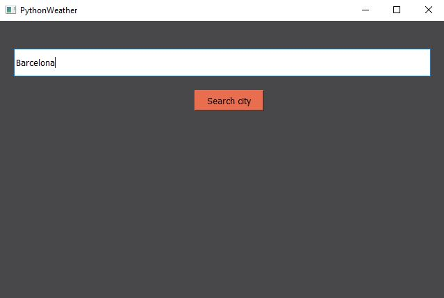
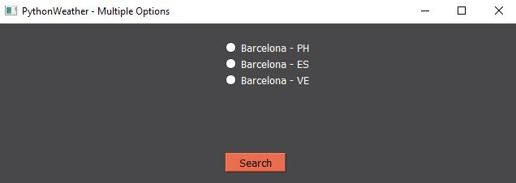
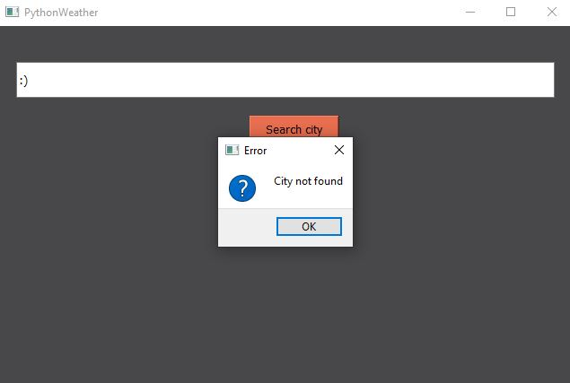
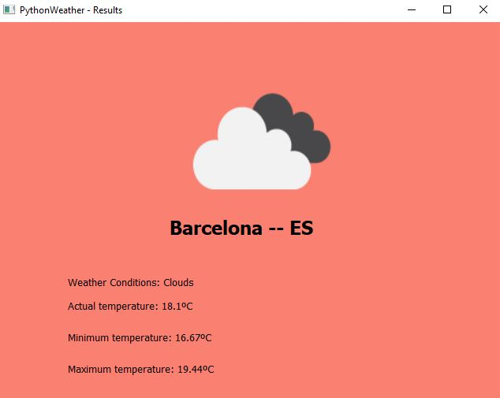

# PythonWeather

This is a project created with Python that shows the actual weather of any chosen city in a **PyQt5** GUI.

The [OpenWeather API](https://openweathermap.org/api) has been used to request all the data.

### Setup

For the program to work, two local files are needed:
1. **APIkey** -- Contains your API key, given by the OpenWeather API when you [register](https://home.openweathermap.org/users/sign_up).
 Just copy and paste the key inside this file.
 
2. **city.list.json** -- This file contains all the information related to the cities covered by the API. It can be downloaded [here](http://bulk.openweathermap.org/sample/city.list.json.gz).

    These two files are read in the **WetaherAPI.py** init function.
    
    ```
    key_filename = "APIkey"
    city_filename = "city.list.json"
    ```

### Example

After setup is done, run **main.py**.
1. First you will be asked for a city.

    
    
2. If the city is found inside the API city list, results will be shown, unless the city's name is repeated.
In that case, a new screen  will appear and you will have to select the country. 

    
    
    If the city is not found, an error window will be prompted.
    
    
    
3. Once the city has been chosen, the results window will appear and show the actual weather conditions, temperature and minimum and maximum temperatures of the day.

    